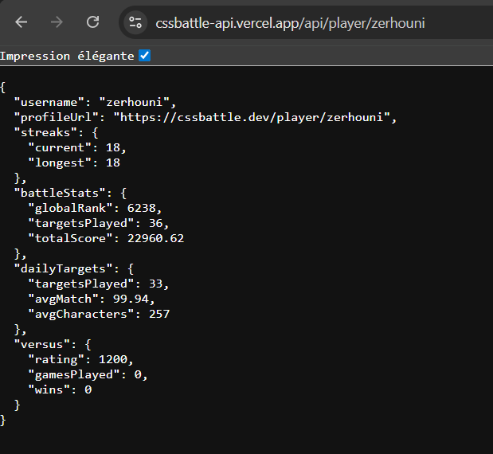

# cssbattle-api

A serverless API that scrapes CSSBattle player profiles using **Puppeteer** (browser automation) and returns clean JSON data. Fully compatible with Vercel.

## Features

- ✅ **Puppeteer-based scraping** (handles JavaScript-rendered content)
- ✅ Serverless Node.js API (Vercel-compatible)
- ✅ Complete player statistics
- ✅ Input validation & error handling
- ✅ Cache headers (1 hour)
- ✅ CORS enabled
- ✅ Production-ready

## Quick Start

### Install Dependencies

```bash
npm install
```

### Development

```bash
npm run dev
```

Server will be available at `http://localhost:3000`

### Deploy to Vercel

```bash
npm run deploy
```

Or connect your GitHub repo to Vercel for automatic deployments.

## API Endpoint

### Get Player Profile

```
GET /api/player/[username]
```

**Example:**
```
GET /api/player/zerhouni
```



**Response:**

```json
{
  "username": "zerhouni",
  "profileUrl": "https://cssbattle.dev/player/zerhouni",
  "streaks": {
    "current": 18,
    "longest": 18
  },
  "battleStats": {
    "globalRank": 6238,
    "targetsPlayed": 36,
    "totalScore": 22960.62
  },
  "dailyTargets": {
    "targetsPlayed": 33,
    "avgMatch": 99.94,
    "avgCharacters": 257
  },
  "versus": {
    "rating": 1200,
    "gamesPlayed": 0,
    "wins": 0
  }
}
```

## Error Responses

**400 - Invalid Username:**
```json
{
  "error": "Invalid username format",
  "message": "Username can only contain letters, numbers, hyphens, and underscores"
}
```

**404 - Player Not Found:**
```json
{
  "error": "Player not found",
  "message": "No player found with username: invalid"
}
```

**500 - Server Error:**
```json
{
  "error": "Internal server error",
  "message": "Failed to scrape profile"
}
```

## How It Works

1. **Browser Rendering**: Uses Puppeteer + Chromium to render the CSSBattle profile page
2. **Data Extraction**: JavaScript DOM queries extract all player statistics
3. **Caching**: Responses cached for 1 hour using Cache-Control headers
4. **Validation**: Username format validated before processing

## Tech Stack

- **Node.js** (ESM)
- **Puppeteer Core** + **@sparticuz/chromium** (headless browser)
- **Vercel** (serverless platform)

## Performance Notes

- First request: 5-10 seconds (Chromium cold start)
- Cached requests: < 100ms
- Function timeout: 15 seconds
- Cache duration: 1 hour (3600 seconds)

## Deployment

This API is configured for Vercel deployment. The vercel.json file includes:
- Function timeout settings
- CORS headers
- Output directory configuration

Simply push to GitHub and connect to Vercel for automatic deployments.

## License

ISC
